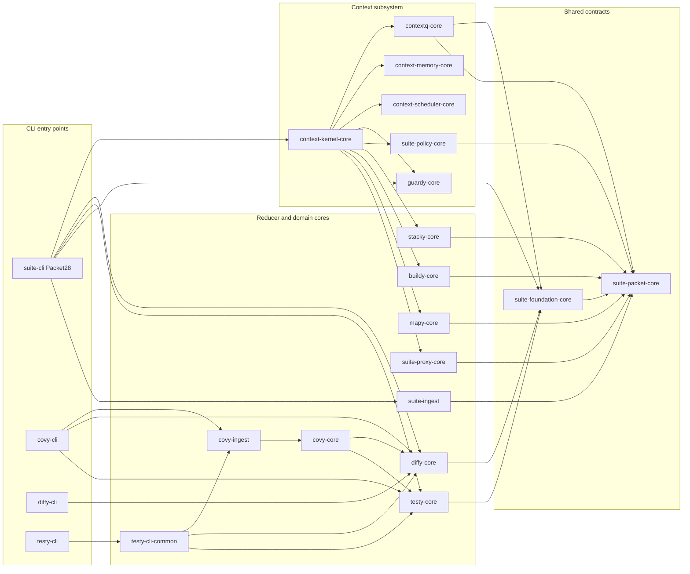
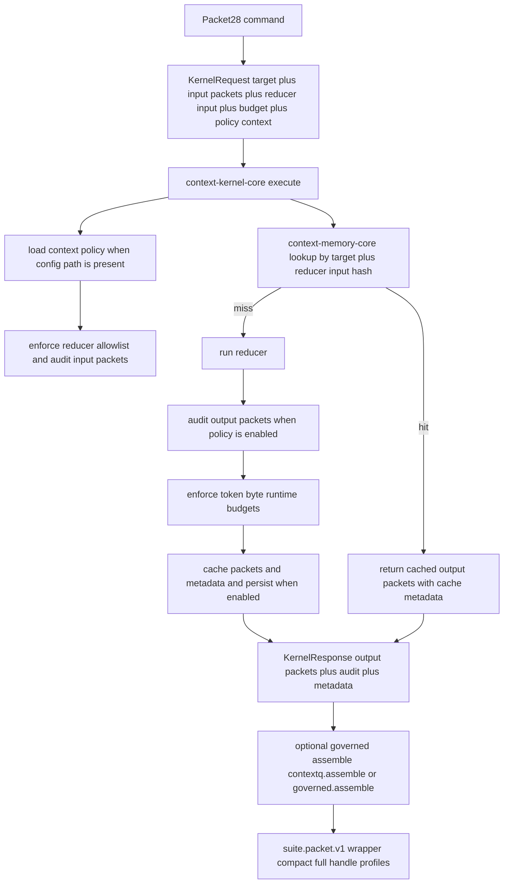
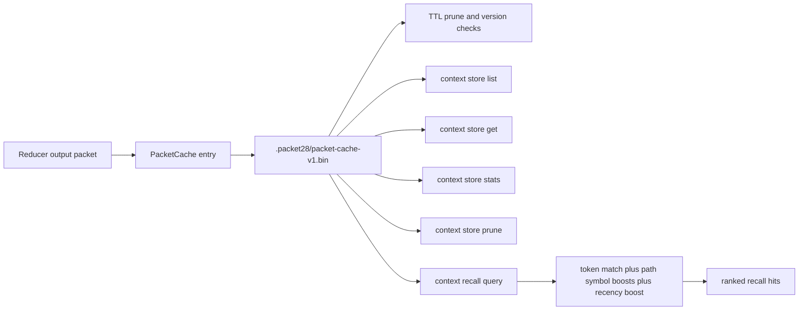

# Packet28 Context Management Workspace

This workspace is a Rust multi-crate platform for producing, governing, assembling, persisting, and recalling machine-readable context packets.

The current center of gravity is `Packet28` (`suite-cli`) plus the context subsystem:
- `context-kernel-core` for orchestration, budgets, governance hooks, cache integration, and sequence execution.
- `contextq-core` for bounded context assembly.
- `context-memory-core` for persistent packet cache + store/recall APIs.
- `context-scheduler-core` for dependency-aware budgeted step scheduling.
- `guardy-core` + `suite-policy-core` for policy validation and packet audit.

## Crate Interaction Map



## Context System Architecture



## Context Store And Recall Lifecycle



## Overall Vision For Context Management

1. One packet contract everywhere.
`EnvelopeV1` and `suite.packet.v1` make every reducer output hashable, budgeted, and machine-consumable.

2. Bounded context by default.
`contextq-core` turns many packets into a single budget-capped context packet with explicit trim metadata.

3. Policy-first execution.
`guardy-core` and `suite-policy-core` are integrated in the kernel path so reducer execution and packet contents are enforceable, not advisory.

4. Reusable local memory.
`context-memory-core` persists reducer outputs with TTL and exposes store/recall APIs so repeated workflows can reuse prior context cheaply.

5. Composable execution graph.
`context-scheduler-core` plus kernel sequence execution provide a base for multi-step dependency-aware pipelines under explicit budgets.

In short: the system is moving toward a governed local context runtime where every tool result is a packet, every packet is auditable, and assembled context is deterministic, bounded, and reusable.

## Minimal Workflow

Build:

```bash
cargo build --release -p suite-cli
```

Validate policy:

```bash
./target/release/Packet28 guard validate --context-config context.yaml
```

Run reducer and governed assembly:

```bash
./target/release/Packet28 diff analyze \
  --coverage tests/fixtures/lcov/basic.info \
  --base HEAD \
  --head HEAD \
  --no-issues-state \
  --json \
  --context-config context.yaml
```

Assemble packets directly:

```bash
./target/release/Packet28 context assemble \
  --packet a.json \
  --packet b.json \
  --budget-tokens 5000 \
  --budget-bytes 32000 \
  --context-config context.yaml
```

Inspect and recall memory:

```bash
./target/release/Packet28 context store stats --root . --json
./target/release/Packet28 context store list --root . --limit 20 --json
./target/release/Packet28 context recall --root . --query "missing mappings parser" --limit 5 --json
```

## Protocol Docs

- `docs/packet-envelope-v1.md`
- `docs/machine-output-contract.md`
- `docs/wire-profiles.md`
- `docs/schema-registry.md`
- `docs/context-store-v1.md`
