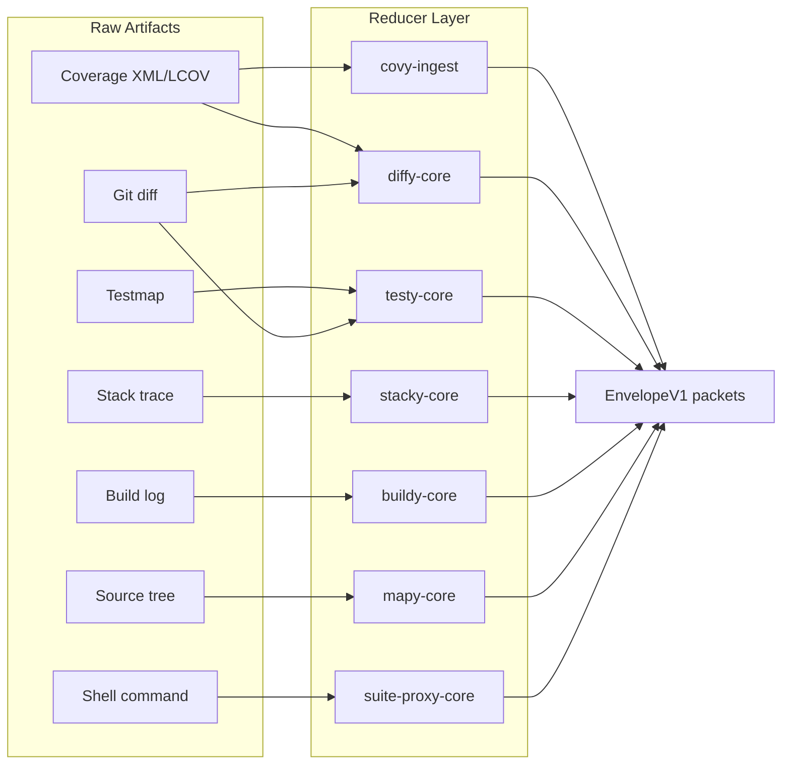
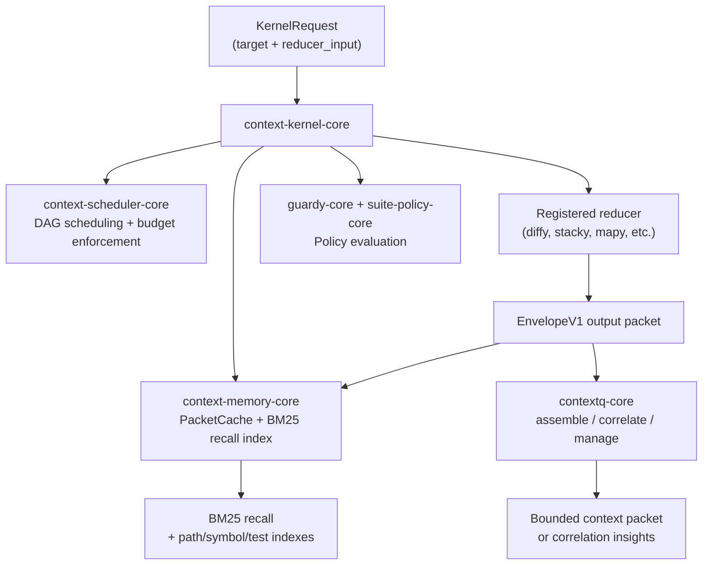
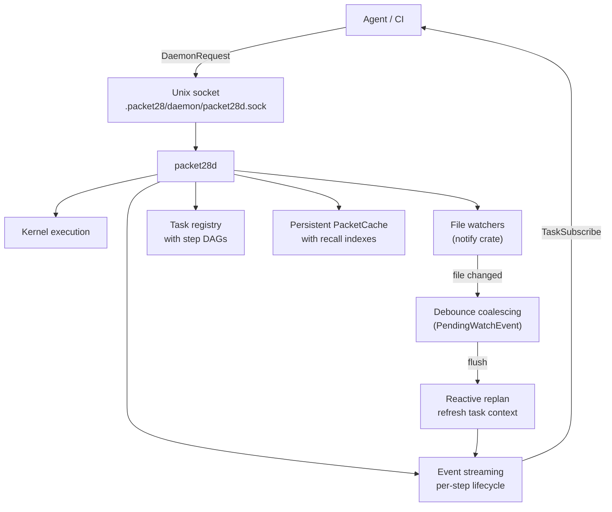
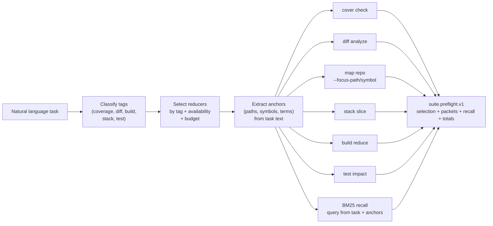
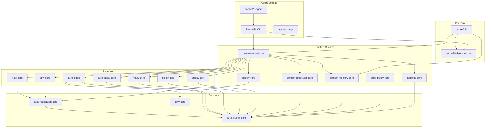

# Packet28

Packet28 is a context engineering layer for AI agents and CI systems. It reduces raw development artifacts — coverage reports, diffs, build logs, stack traces, test results, repo structure — into bounded, machine-readable packets that fit within agent context windows. It persists, indexes, and recalls those packets across tasks, and manages token budgets so agents spend context on reasoning instead of exploration.

## The Problem

An AI agent asked to "fix the coverage regression in AuthService" will typically:

1. Read config files to find coverage report paths
2. Grep for source files matching "AuthService"
3. Read the coverage XML (often megabytes, may not fit in context)
4. Read the git diff to understand what changed
5. Read test files to see what's covered

This costs 10-20 tool calls and 5-50K tokens of raw content before the agent starts working. Most of that content is redundant, unstructured, and immediately stale.

## The Solution

```bash
Packet28 preflight --task "fix coverage regression in AuthService" --json
```

Packet28 classifies the task, selects the right reducers (cover, diff, map, recall), runs them, and returns one bounded JSON payload with pre-analyzed results:

- Coverage gate status with percentages and violations (~800 tokens)
- Diff analysis with changed files and coverage impact (~1200 tokens)
- Repo map focused on AuthService with ranked files and symbols (~2000 tokens)
- Recall hits from prior related work (~600 tokens)

Total: ~4600 tokens, 0 tool calls, under 150ms. The agent starts working immediately with structured, relevant context.

## Architecture

Packet28 is a Rust workspace of 24 crates organized into four layers:

```
┌─────────────────────────────────────────────────────────────────┐
│                        Agent Surface                            │
│  packet28-agent wrapper · agent-prompt generator · preflight    │
├─────────────────────────────────────────────────────────────────┤
│                     CLI + Daemon Layer                          │
│  Packet28 CLI · packet28d daemon · task/watch/stream protocol   │
├─────────────────────────────────────────────────────────────────┤
│                    Context Runtime Layer                        │
│  kernel · scheduler · memory/recall · assembly · correlation    │
│  policy/guard · agent state                                     │
├─────────────────────────────────────────────────────────────────┤
│                       Reducer Layer                             │
│  diffy · covy · testy · stacky · buildy · mapy · proxy          │
├─────────────────────────────────────────────────────────────────┤
│                     Shared Contracts                            │
│  EnvelopeV1 · BudgetCost · FileRef/SymbolRef · Provenance       │
│  suite-packet-core · suite-foundation-core                      │
└─────────────────────────────────────────────────────────────────┘
```

### Layer 1: Shared Contracts

Every reducer output is wrapped in the same envelope:

```json
{
  "schema_version": "suite.packet.v1",
  "packet_type": "suite.<domain>.<action>.v1",
  "packet": {
    "version": "1",
    "tool": "...",
    "kind": "...",
    "hash": "...",
    "summary": "...",
    "files": [{ "path": "...", "relevance": 0.75 }],
    "symbols": [{ "name": "...", "kind": "method", "relevance": 0.6 }],
    "budget_cost": {
      "est_tokens": 800,
      "est_bytes": 3200,
      "runtime_ms": 12,
      "tool_calls": 1
    },
    "provenance": {
      "inputs": ["src/auth.rs"],
      "git_base": "origin/main",
      "git_head": "HEAD",
      "generated_at_unix": 1709000000
    },
    "payload": {}
  }
}
```

`EnvelopeV1<T>` is the universal packet type. Every packet carries:

- **`budget_cost`**: Token and byte estimates so consumers know the cost before reading the payload
- **`files` and `symbols`**: Structured references that enable cross-packet correlation
- **`provenance`**: Git refs and input paths for reproducibility
- **`hash`**: Canonical blake3 hash for deduplication and cache keying

| Crate | Purpose |
| --- | --- |
| `suite-packet-core` | `EnvelopeV1`, `BudgetCost`, `FileRef`, `SymbolRef`, `Provenance`, packet type constants, agent state event types |
| `suite-foundation-core` | `CovyConfig` (covy.toml), gate config, path mapping, snapshot/cache primitives |
| `covy-core` | Coverage data model shared between ingestion and analysis |

### Layer 2: Reducers

Each reducer takes a raw artifact and produces a bounded `EnvelopeV1` packet:

| Crate | Input | Output | What It Does |
| --- | --- | --- | --- |
| `covy-ingest` | JaCoCo XML, LCOV, Cobertura, gocov, llvm-cov | Normalized coverage model | Parses coverage reports into a unified format with path normalization |
| `diffy-core` | Git diff + coverage data | `suite.diff.analyze.v1` | Runs diff analysis against a quality gate: changed/total/new coverage, issue counts, violations |
| `testy-core` | Testmap + git diff | `suite.test.impact.v1` | Computes impacted tests from file changes using a prebuilt test-to-file map |
| `stacky-core` | Log text / stack traces | `suite.stack.slice.v1` | Deduplicates failures by fingerprint, extracts frames, limits to N worst |
| `buildy-core` | Compiler / linter output | `suite.build.reduce.v1` | Groups diagnostics by root cause and severity, deduplicates by fingerprint |
| `mapy-core` | Repository root + focus hints | `suite.map.repo.v1` | Builds a ranked repo map: files by centrality, symbols by relevance, import edges. Uses tree-sitter for symbol extraction |
| `suite-proxy-core` | Shell command + output limits | `suite.proxy.run.v1` | Executes a command safely, deduplicates output lines, enforces output caps |
| `suite-ingest` | Coverage/diagnostics file paths | Ingested models | Thin wrapper dispatching to `covy-ingest` format parsers |



### Layer 3: Context Runtime

The runtime layer manages execution, caching, recall, assembly, correlation, scheduling, and policy enforcement.



#### Kernel (`context-kernel-core`)

The kernel is the central dispatch. It receives a `KernelRequest` with a `target` string and routes to a registered reducer:

| Target | Reducer |
| --- | --- |
| `diffy.analyze` | Diff analysis against quality gate |
| `testy.impact` | Test impact from diff + testmap |
| `stacky.slice` | Stack trace deduplication |
| `buildy.reduce` | Build diagnostic reduction |
| `mapy.repo` | Repo structure mapping |
| `proxy.run` | Safe command execution |
| `contextq.assemble` | Merge packets into bounded context |
| `contextq.correlate` | Synthesize insights across packets |
| `contextq.manage` | Budget-aware context guidance |
| `governed.assemble` | Policy-constrained assembly |
| `guardy.check` | Guard policy evaluation |
| `agenty.state.write` | Append agent state event |
| `agenty.state.snapshot` | Read agent state snapshot |

The kernel supports two execution modes:

- **Single request**: `execute(request)` — runs one reducer, optionally caches the result
- **Sequence**: `execute_sequence(steps)` — runs a DAG of steps with dependency ordering, budget enforcement, and reactive replanning via `ScheduleMutation` (cancel/replace/append steps based on prior results)

#### Memory and Recall (`context-memory-core`)

Packets are persisted in `.packet28/packet-cache-v2.bin` (bincode). The cache maintains six indexes:

| Index | Key | Value | Used For |
| --- | --- | --- | --- |
| `recall_postings` | Term | (cache_key, term_frequency) | BM25 full-text search |
| `file_ref_index` | Canonical path | Cache keys | Path-based lookup |
| `basename_alias_index` | Filename only | Canonical paths | Cross-reducer path normalization |
| `symbol_index` | Symbol name | Cache keys | Symbol-based lookup |
| `test_index` | Test name | Cache keys | Test-based lookup |
| `task_index` | Task ID | Cache keys | Per-task scoping |

Recall uses BM25 scoring (k1=1.5, b=0.75) plus structured field matching. A query like "coverage gap in AuthService" matches both text terms and the symbol index. Results are ranked by a weighted combination of BM25 score, path/symbol match bonuses, and recency.

```rust
RecallOptions {
    limit: 8,
    scope: TaskFirst,       // Task-scoped entries first, then global
    path_filters: ["src/auth.rs"],
    symbol_filters: ["AuthService"],
    since_unix: Some(week_ago),
}
```

Recall returns `RecallHit` with score, summary, matched paths/symbols, match reasons, budget estimate, and associated task IDs.

#### Assembly and Correlation (`contextq-core`)

- **Assemble**: Merges multiple reducer packets into one bounded context packet. Extracts sections and refs from each input, ranks by relevance, truncates to fit `budget_tokens` and `budget_bytes`. Output: `AssembledPayload` with sections, refs, and truncation metadata.
- **Correlate**: Finds relationships across packets using four rules:
  - `shared_file`: Packets reference the same file path (with basename normalization)
  - `shared_symbol`: Packets reference the same symbol
  - `shared_test`: Packets reference the same test
  - `map_edge_connects`: A repo map edge connects files from different packets
- **Manage**: Produces budget-aware guidance: working set size, eviction candidates, recommendations for which packets to keep or drop.

#### Scheduler (`context-scheduler-core`)

Topological DAG scheduler with budget enforcement. Takes a set of steps with dependencies and estimated costs, orders them, and stops when budget is exhausted. Supports reactive mutations: cancel, replace, or append steps mid-sequence based on reducer outputs.

#### Policy and Guard (`guardy-core`, `suite-policy-core`)

Optional governance via `context.yaml`:

```yaml
version: 1
policy:
  tools:
    allowlist: [Packet28, git]
  reducers:
    allowlist: [diffy.analyze, mapy.repo, stacky.slice]
  paths:
    include: ["src/**"]
    exclude: ["**/*.secret"]
  budgets:
    token_cap: 10000
    runtime_ms_cap: 5000
  redaction:
    forbidden_patterns: ["SECRET_KEY_\\w+"]
  human_review:
    required: false
    on_policy_violation: true
```

Guard evaluates packets against policy and reports violations. Governed assembly applies policy constraints during context assembly.

### Layer 4: CLI, Daemon, and Agent Surface

#### Packet28 CLI (`suite-cli`)

The umbrella CLI exposes all domains through a consistent interface:

```
Packet28 cover check          Coverage quality gate
Packet28 diff analyze         Diff analysis against gate
Packet28 test impact          Impacted tests from diff
Packet28 test shard           Test shard planning
Packet28 test map             Build testmap artifacts
Packet28 stack slice          Stack trace reduction
Packet28 build reduce         Build diagnostic reduction
Packet28 map repo             Repo structure mapping
Packet28 proxy run            Safe command execution
Packet28 context assemble     Merge packets into bounded context
Packet28 context correlate    Cross-packet insight synthesis
Packet28 context manage       Budget-aware context guidance
Packet28 context state        Agent state append/snapshot
Packet28 context store        List/get/prune/stats on persisted packets
Packet28 context recall       BM25 + structured recall query
Packet28 guard validate       Validate policy config
Packet28 guard check          Evaluate packet against policy
Packet28 packet fetch         Retrieve persisted artifact by handle
Packet28 preflight            Bounded agent context for a task
Packet28 agent-prompt         Generate agent instruction fragments
Packet28 mcp serve|proxy      Expose Packet28 as an MCP server or proxy upstream MCP servers
Packet28 daemon               Daemon lifecycle and task management
Packet28 setup                Configure Claude/Cursor/Codex integration files
```

Reducer, packet, preflight, and context commands emit `suite.packet.v1` JSON wrappers. Three output profiles:

- `--json` or `--json=compact`: Bounded compact payload
- `--json=full`: Complete payload with all fields
- `--json=handle`: Compact output + persisted artifact handle for later `packet fetch`

Exit codes: `0` success/passing, `1` domain failure, `2+` runtime/config error.

#### Daemon (`packet28d`)

A local Unix socket daemon that provides persistent state, file watching, task streaming, and command routing for long-running agent workflows.



**Daemon protocol** (`packet28-daemon-core`):

| Request | Response | Purpose |
| --- | --- | --- |
| `Execute` | `Execute` | Run single kernel request |
| `ExecuteSequence` | `ExecuteSequence` | Submit multi-step task with watches |
| `TaskStatus` | `TaskStatus` | Query task state |
| `TaskCancel` | `TaskCancel` | Cancel task and remove watches |
| `TaskSubscribe` | `TaskSubscribeAck` + streaming events | Live per-step lifecycle events |
| `WatchList` / `WatchRemove` | Watch metadata | Manage file watchers |
| `CoverCheck` | `CoverCheck` | Direct cover check (no kernel overhead) |
| `ContextRecall` | `ContextRecall` | Recall from daemon's persistent cache |
| `ContextStore*` | Store metadata | List/get/prune/stats on cache |
| `Status` / `Stop` | `Status` / `Ack` | Daemon lifecycle |

Watch kinds: `File` (glob pattern), `Git` (ref changes), `TestReport` (test result files).

Daemon persistence:
- `.packet28/daemon/packet28d.sock` — Unix socket
- `.packet28/daemon/runtime.json` — PID, startup time, socket path
- `.packet28/daemon/packet28d.log` — Daemon logs
- `.packet28/daemon/watch-registry-v1.json` — Active watches
- `.packet28/daemon/task-registry-v1.json` — Task state
- `.packet28/daemon/tasks/<id>/events.jsonl` — Per-task event log
- `.packet28/packet-cache-v2.bin` — Persistent packet cache with indexes

The `--via-daemon` flag on any Packet28 command routes execution through the daemon instead of running locally. The daemon auto-starts if not running.

#### Agent Surface

Three entry points for agent integration:

**`Packet28 setup`** is the fastest way to wire Packet28 into a local agent runtime:

```bash
Packet28 setup --runtime all --yes
```

It updates project-local MCP config where supported (`.mcp.json`, `.cursor/mcp.json`), writes fallback prompt fragments for Claude/Cursor/Codex, and prepares the daemon index.

**`Packet28 agent-prompt`** generates instruction fragments for agent config files:

```bash
Packet28 agent-prompt --format claude    # CLAUDE.md fragment
Packet28 agent-prompt --format agents    # AGENTS.md fragment
Packet28 agent-prompt --format cursor    # .cursorrules fragment
```

Output tells the agent how to use Packet28's broker and bounded context flow before broad file reads, while still falling back to direct reads for trivial edits or broker failures.

**`packet28-agent`** is a wrapper binary that fetches broker context automatically before delegating to an agent runtime:

```bash
packet28-agent \
  --task "investigate flaky parser test" \
  -- codex exec "review the failure"
```

The wrapper:
1. Resolves a stable task ID from `--task`
2. Fetches bounded broker context and persists it to `.packet28/agent/latest-preflight.json`
3. Exports `PACKET28_*` environment variables for the brief, state snapshot, broker tools, MCP command, and repo root
4. Executes the delegated command, propagating its exit code

#### Preflight

Preflight is the primary agent entry point. It maps a natural language task description to the right reducers, runs them, and returns one bounded payload.



Heuristic selection:

| Task mentions | Reducers selected |
| --- | --- |
| coverage, jacoco, lcov, gate | cover + diff + map + recall |
| diff, change, regression, review, pr | diff + map + recall |
| build, compile, lint, warning, error | build + diff + recall |
| stack, trace, exception, crash, panic | stack + map + recall |
| test, impact, flaky | impact + diff + recall |
| (none of the above) | diff + map + recall |

Reducers are selected in execution order (cover → diff → map → stack → build → impact → recall) and trimmed when cumulative planned cost exceeds `--budget-tokens` (default 5000). `--include` and `--exclude` flags override heuristics. Recall always runs last and always uses BM25 against the task description + extracted anchors.

## Binaries

| Binary | Package | Purpose |
| --- | --- | --- |
| `Packet28` | `suite-cli` | Umbrella CLI for all domains |
| `packet28-agent` | `suite-cli` | Wrapper that runs preflight before delegating to an agent |
| `packet28d` | `packet28d` | Local daemon for persistent state and file watching |
| `covy` | `covy-cli` | Legacy coverage CLI: check, ingest, report, diff, testmap, impact, shard, merge |
| `diffy` | `diffy-cli` | Diff-focused gate analysis |
| `testy` | `testy-cli` | Test impact and sharding |

## Crate Map

| Group | Crates |
| --- | --- |
| Shared contracts | `suite-packet-core`, `suite-foundation-core`, `covy-core` |
| Reducers | `covy-ingest`, `diffy-core`, `testy-core`, `stacky-core`, `buildy-core`, `mapy-core`, `suite-proxy-core`, `suite-ingest` |
| Context runtime | `context-kernel-core`, `context-memory-core`, `context-scheduler-core`, `contextq-core` |
| Governance | `guardy-core`, `suite-policy-core` |
| CLI + daemon | `suite-cli`, `packet28-daemon-core`, `packet28d` |
| Legacy CLIs | `covy-cli`, `diffy-cli`, `testy-cli`, `testy-cli-common` |



## Persistence

All persistent state lives under `.packet28/` at the workspace root:

```
.packet28/
├── packet-cache-v2.bin          Packet cache with BM25 + ref indexes (bincode)
├── artifacts/                   Full packet artifacts for --json=handle
├── agent/
│   └── latest-preflight.json    Last preflight result from packet28-agent
└── daemon/
    ├── packet28d.sock           Unix socket
    ├── runtime.json             Daemon PID and metadata
    ├── packet28d.log            Daemon log
    ├── watch-registry-v1.json   Active file watches
    ├── task-registry-v1.json    Task state
    └── tasks/
        └── <task-id>/
            └── events.jsonl     Per-task event log
```

Coverage state from the legacy `covy` CLI lives under `.covy/state/`.

## Installation

Build from source:

```bash
cargo build --release -p suite-cli -p packet28d
```

Or install the npm wrapper binaries:

```bash
npm install -g packet28
```

The npm package installs:

- `packet28` for the main CLI
- `packet28-mcp` for `Packet28 mcp serve`

## Quick Start

Auto-configure local agent files and MCP config:

```bash
./target/release/Packet28 setup --runtime all --yes
```

Run Packet28 as an MCP server:

```bash
./target/release/Packet28 mcp serve --root .
# or, if installed via npm:
packet28-mcp --root .
```

Run preflight for a task:

```bash
./target/release/Packet28 preflight \
  --task "fix coverage regression in AuthService" \
  --json
```

Generate agent instructions directly:

```bash
./target/release/Packet28 agent-prompt --format claude >> CLAUDE.md
```

Use the wrapper to launch an agent with broker context:

```bash
./target/release/packet28-agent \
  --task "investigate flaky parser test" \
  -- codex exec "review the failure"
```

Run individual reducers:

```bash
# Coverage gate
./target/release/Packet28 cover check \
  --coverage report.xml --base HEAD~1 --head HEAD --json

# Diff analysis
./target/release/Packet28 diff analyze \
  --coverage report.xml --base HEAD~1 --head HEAD --json

# Repo map focused on a symbol
./target/release/Packet28 map repo \
  --repo-root . --focus-symbol AuthService --json

# Stack trace reduction
./target/release/Packet28 stack slice --input crash.log --json

# Build diagnostic reduction
./target/release/Packet28 build reduce --input build.log --json

# Test impact
./target/release/Packet28 test impact \
  --base main --head HEAD --testmap .covy/state/testmap.bin --json
```

Recall prior context:

```bash
./target/release/Packet28 context recall \
  --root . --query "coverage gap AuthService" --limit 5 --json
```

Start the daemon for persistent state and file watching:

```bash
./target/release/Packet28 daemon start --root .
./target/release/Packet28 daemon status --root . --json
```

Route commands through the daemon:

```bash
./target/release/Packet28 diff analyze \
  --coverage report.xml --base HEAD~1 --head HEAD \
  --via-daemon --json
```

Assemble multiple packets into a bounded context:

```bash
./target/release/Packet28 context assemble \
  --packet cover.json --packet diff.json --packet map.json \
  --budget-tokens 5000 --json
```

## Configuration

`covy.toml` is the shared config entry point:

```toml
[project]
name = "my-project"

[ingest]
report_paths = ["target/site/jacoco/jacoco.xml"]
strip_prefixes = ["src/main/java/"]

[diff]
base = "origin/main"
head = "HEAD"

[gate]
fail_under_total = 80.0
fail_under_changed = 90.0

[gate.issues]
max_new_errors = 0
max_new_warnings = 5
```

Optional governance via `context.yaml` for policy-constrained execution. The current machine-readable reference material lives in `schemas/` and `scripts/ci/`.

## Reference Artifacts

| Artifact | Path |
| --- | --- |
| Packet wrapper schema | `schemas/packet-wrapper/suite.packet.v1.schema.json` |
| Packet type schemas | `schemas/packet-types/` |
| Snapshot fixtures for compact/full/handle profiles | `schemas/snapshots/` |
| GitHub Actions example | `scripts/ci/github-actions.yml` |
| GitLab CI example | `scripts/ci/gitlab-ci.yml` |
| Benchmark notes | `scripts/benchmark_packet28.md` |
| Agent search benchmark harness | `scripts/benchmark_agent_search.md` |

Repository-local MCP config example: `.mcp.json`.

## Project Stats

- ~58K lines of Rust across 119 source files
- ~8K lines of Rust tests across 12 test files
- 24 crates in the workspace
- 6 binaries (Packet28, packet28-agent, packet28d, covy, diffy, testy)
