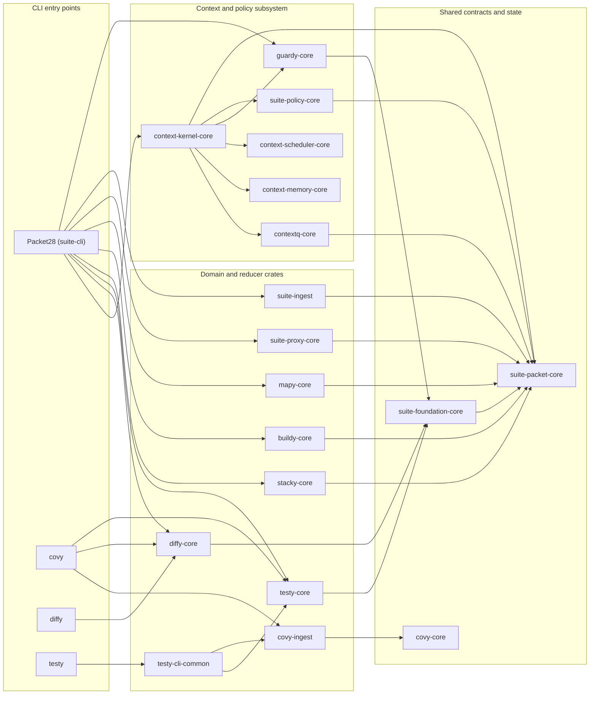
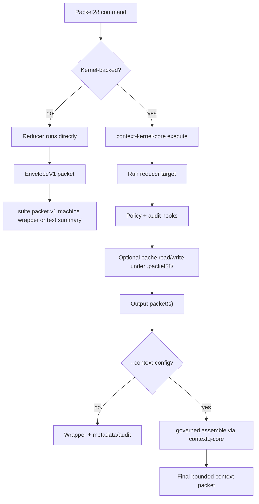
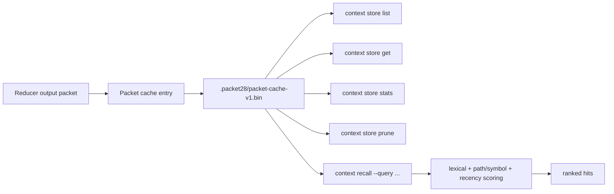
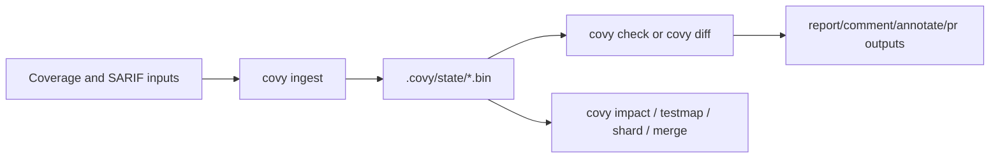

# Coverage / Packet28 Workspace

This repository is a Rust multi-crate workspace for:

- coverage ingestion and gating
- diff-aware diagnostics analysis
- test impact analysis and sharding
- deterministic repo, build, stack, and proxy reduction
- governed context packet assembly, storage, recall, and policy enforcement

The current umbrella CLI is `Packet28` (`suite-cli`). Legacy and focused CLIs remain available as compatibility and domain-specific entry points:

- `covy` for coverage-first workflows
- `diffy` for diff analysis
- `testy` for impact, sharding, and testmap workflows

## What Changed

The workspace is no longer just a coverage gate plus helpers. It now centers on a shared packet protocol and a kernel-driven execution path that can:

- emit stable machine-readable packet wrappers
- cache and persist reducer outputs under `.packet28/`
- apply policy checks through `guardy-core` and `suite-policy-core`
- assemble bounded final context packets for agent and CI consumers

## Workspace Architecture



## Main Binaries

| Binary | Package | Purpose |
| --- | --- | --- |
| `Packet28` | `suite-cli` | Umbrella CLI for cover, diff, test, context, guard, stack, build, map, proxy, and packet flows |
| `covy` | `covy-cli` | Coverage ingestion, reports, PR artifacts, path mapping, merge, doctor |
| `diffy` | `diffy-cli` | Diff-focused gate analysis |
| `testy` | `testy-cli` | Test impact, sharding, and testmap commands |

## Packet28 Command Surface

`Packet28` currently exposes these top-level domains:

- `cover check`
- `diff analyze`
- `test impact`
- `test shard`
- `test map`
- `guard validate`
- `guard check`
- `context assemble`
- `context correlate`
- `context state append`
- `context state snapshot`
- `context store list|get|prune|stats`
- `context recall`
- `stack slice`
- `build reduce`
- `map repo`
- `proxy run`
- `packet fetch`

## Execution Model

Most Packet28 reducers can run in two modes:

1. Direct reducer mode for fast local output.
2. Kernel-backed mode when you enable `--cache`, `--task-id`, or `--context-config`.

Kernel-backed mode adds cache metadata, policy context, packet persistence, and optional governed assembly.



## Machine Output Contract

All Packet28 machine-mode commands use the same wrapper:

```json
{
  "schema_version": "suite.packet.v1",
  "packet_type": "suite.<domain>.<action>.v1",
  "packet": {
    "version": "1",
    "tool": "...",
    "kind": "...",
    "hash": "...",
    "summary": "...",
    "budget_cost": {},
    "provenance": {},
    "payload": {}
  }
}
```

Machine profiles:

- `--json` or `--json=compact` for bounded compact payloads
- `--json=full` for the full payload
- `--json=handle` for compact wire output plus a persisted packet artifact handle

Exit codes:

- `0` for success and passing gates/policy
- `1` for domain failure with a valid command run
- `2+` for runtime, config, or execution failures

## Cache, Store, And Recall

When persistence is enabled, Packet28 stores cache state under `.packet28/` at the workspace or explicit root.

- cache file: `.packet28/packet-cache-v1.bin`
- artifact directory: `.packet28/artifacts/`
- packet fetch path: `Packet28 packet fetch --handle <handle_id>`



## Quick Start

Build the primary binaries:

```bash
cargo build --release -p suite-cli -p covy-cli -p diffy-cli -p testy-cli
```

Run a diff gate through the umbrella CLI:

```bash
./target/release/Packet28 diff analyze \
  --coverage tests/fixtures/lcov/basic.info \
  --base HEAD \
  --head HEAD \
  --no-issues-state \
  --json
```

Run the legacy coverage-first CLI:

```bash
./target/release/covy check \
  --coverage tests/fixtures/lcov/basic.info \
  --base HEAD \
  --head HEAD \
  --no-issues-state
```

## Common Workflows

### 1. Coverage Gate

```bash
./target/release/Packet28 cover check \
  --coverage tests/fixtures/lcov/basic.info \
  --base HEAD \
  --head HEAD \
  --no-issues-state \
  --json=compact
```

### 2. Diff Analysis With Governed Context

```bash
./target/release/Packet28 diff analyze \
  --coverage tests/fixtures/lcov/basic.info \
  --base HEAD~1 \
  --head HEAD \
  --no-issues-state \
  --cache \
  --context-config context.yaml \
  --json=full
```

### 3. Repo Map With Artifact Handle

```bash
./target/release/Packet28 map repo \
  --repo-root . \
  --focus-path crates/suite-cli/src \
  --focus-symbol KernelRequest \
  --cache \
  --json=handle
```

Fetch the full artifact later:

```bash
./target/release/Packet28 packet fetch \
  --root . \
  --handle <handle_id> \
  --json=full
```

### 4. Test Impact And Sharding

Build a testmap:

```bash
./target/release/Packet28 test map \
  --manifest 'tests/**/*.json' \
  --output .covy/state/testmap.bin \
  --timings-output .covy/state/testtimings.bin
```

Compute impacted tests:

```bash
./target/release/Packet28 test impact \
  --base main \
  --head HEAD \
  --testmap .covy/state/testmap.bin \
  --print-command \
  --json
```

Plan shards:

```bash
./target/release/Packet28 test shard \
  --tasks-json tasks.json \
  --shards 6 \
  --tier nightly \
  --timings .covy/state/testtimings.bin \
  --json
```

### 5. Stack And Build Reduction

```bash
./target/release/Packet28 stack slice \
  --input crash.log \
  --max-failures 25 \
  --json

./target/release/Packet28 build reduce \
  --input build.log \
  --max-diagnostics 100 \
  --json
```

### 6. Context Assembly, State, And Recall

Assemble packets into a bounded context packet:

```bash
./target/release/Packet28 context assemble \
  --packet a.json \
  --packet b.json \
  --budget-tokens 5000 \
  --budget-bytes 32000 \
  --json
```

Correlate packets for a task:

```bash
./target/release/Packet28 context correlate \
  --packet a.json \
  --packet b.json \
  --task-id task-123 \
  --json
```

Append and snapshot task state:

```bash
./target/release/Packet28 context state append \
  --task-id task-123 \
  --input event.json \
  --root . \
  --json

./target/release/Packet28 context state snapshot \
  --task-id task-123 \
  --root . \
  --json
```

Inspect persisted memory:

```bash
./target/release/Packet28 context store stats --root . --json
./target/release/Packet28 context store list --root . --limit 20 --json
./target/release/Packet28 context recall --root . --query "missing mappings parser" --limit 5 --json
```

### 7. Guard And Policy Checks

Validate policy config:

```bash
./target/release/Packet28 guard validate --context-config context.yaml
```

Evaluate a packet against policy:

```bash
./target/release/Packet28 guard check \
  --packet packet.json \
  --context-config context.yaml \
  --json
```

## Legacy Covy Workflow

`covy` is still the shortest path for classic coverage automation. It currently supports:

- `check`
- `ingest`
- `report`
- `diff`
- `testmap`
- `impact`
- `comment`
- `annotate`
- `pr`
- `init`
- `doctor`
- `map-paths`
- `shard`
- `merge`
- `github-comment`

Typical flow:



## Configuration

`covy.toml` remains the shared config entry point for coverage, diff, path mapping, test impact, and shard planning. Start from:

- `covy.toml.example`

Important sections:

- `[ingest]` for report discovery and path normalization
- `[diff]` for base/head refs
- `[gate]` and `[gate.issues]` for thresholds
- `[impact]` for testmap behavior
- `[shard]` for planner defaults
- `[paths]` for prefix stripping and replacement rules

## Crate Groups

| Group | Crates |
| --- | --- |
| Coverage and ingestion | `covy-core`, `covy-ingest`, `suite-ingest` |
| Diff and tests | `diffy-core`, `testy-core`, `testy-cli-common` |
| Context runtime | `context-kernel-core`, `contextq-core`, `context-memory-core`, `context-scheduler-core` |
| Reducers | `stacky-core`, `buildy-core`, `mapy-core`, `suite-proxy-core` |
| Governance and contracts | `guardy-core`, `suite-policy-core`, `suite-foundation-core`, `suite-packet-core` |
| CLI packages | `suite-cli`, `covy-cli`, `diffy-cli`, `testy-cli` |

## Protocol And Design Docs

- `docs/machine-output-contract.md`
- `docs/wire-profiles.md`
- `docs/packet-envelope-v1.md`
- `docs/schema-registry.md`
- `docs/context-store-v1.md`
- `docs/ci-agent-examples.md`

Schema artifacts live under:

- `schemas/packet-wrapper/`
- `schemas/packet-types/`
- `schemas/snapshots/`

## Benchmarks

Coverage benchmark harnesses live under:

- `benchmarks/`
- `hyperfine/`

Start with:

```bash
./benchmarks/run.sh
```

## Repository Status

The repository name still reflects its coverage-tool origins, but the codebase now spans a broader packet and context runtime. If you are integrating with the current system, prefer `Packet28` and the shared `suite.packet.v1` machine contract first; use `covy`, `diffy`, and `testy` when you want a narrower workflow or compatibility surface.
